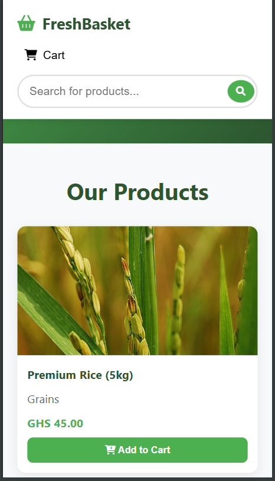

<p align="center">
  <h1 align="center"> FreshBasket </h1>
</p>

<p align="center">
	<em>
    <code>Online Marketplace for Grocery Shopping </code>
  </em>
</p>

<p align="center">
	
	
	
	
</p>

<p align="center">
  
</p>

<details>
  <summary>Table of Contents</summary>

- [📍 Overview](#📍-overview)
- [🚀 Features](#🚀-features)
- [📁 Project Structure](#📁-project-structure)
- [📌 Getting Started](#📌-getting-started)
  - [☑️ Prerequisites](#☑️-prerequisites)
  - [⚙️ Installation](#⚙️-installation)
  - [🤖 Usage](#🤖-usage)
  - [🚀 Deploying on Vercel](#🚀-deploying-on-vercel)
- [🔰 Contributing](#🔰-contributing)
- [🙌 Acknowledgments](#🙌-acknowledgments)
- [📚 References](#📚-references)
- [📝 License](#📝-license)

</details>

## 📍 Overview

**FreshBasket** is a web based application built with Flask that simulates an online grocery store. It allows users to browse a catalog of products, add items to a shopping cart,  and proceed through a simulated checkout process.

## Pygrocers Group Project: Web Application

### Instructions

1. Join a group of 5 people and select any web application project of your choice, build it and upload it to your github account.
   Share the github repo link as your answer.

2. Find a free webhosting and domain online and publish your web application

### 👥 Team Members

- David Kofi Ankuyi **01245469B**
-  Amenakpor Micheal **01246557B**
-  Gabriel Morrison Junior**01242758B**
-  Narh Aaron Freeman **01245109B**
- Lartey Joseph Kojo **01245683B**


#### 🚀 Live Demo

🌐 [FreshBasket](https://freshbasket-g2d0.onrender.com/)

---

#### Example Screenshots

<p align="center">
   
</p>

## 🚀 Features

- Product catalog pages with images and prices.
- Add/remove items from a session-backed shopping cart.
- Cart summary and simulated checkout pages.
- Simple, responsive UI using Bootstrap (and optionally Tailwind in templates).
- Clear single-file entrypoint (`app.py`) so beginners can follow the control flow.

## 📁 Project Structure

```
FreshBasket
├── templates              # Project Templates.
├── images                 # Project Static images.
├── app.py                 # Project main.
├── requirements.txt       # Lists the Python dependencies of your project.
├── .gitignore             # Specifies files and directories to be ignored by Git.
├── LICENSE                # Project License.
└── README.md              # Project Documentation.
```

## 📌 Getting Started

### 📜 Technologies & Tools

- **Flask** (backend framework)
- **Bootstrap 5 & Tailwind CSS** (UI/UX)
- **Render** (deployment)

#### ☑️ Prerequisites

- [Python 3.8+](https://www.python.org/downloads/)
- [Vercel account](https://vercel.com/) (for deployment)

#### 🧰 Additionals

- [Git](https://git-scm.com/) – (Optional) Version control

### ⚙️ Installation & Local Setup

1. **Clone the repository:**
   ```bash
   git clone https://github.com/Joseph2004-cpu/FreshBasket.git
   cd FreshBasket
   ```
2. **Install Python dependencies:**
   ```bash
   pip install -r requirements.txt
   ```
3. **Run the development server:**
   ```bash
   python app.py
   ```

### 🤖 Usage

1. Open your browser and go to `http://127.0.0.1:5050/`

### 🚀 Deploying on Render

## 🔰 Contributing

Feel free to submit issues or pull requests if you have suggestions or improvements for the game.

- **💬 [Join the Discussions](https://github.com/Joseph2004-cpu/FreshBasket/discussions)**: Share your insights, provide feedback, or ask questions.
- **🐛 [Report Issues](https://github.com/Joseph2004-cpu/FreshBasket/issues)**: Submit bugs found or log feature requests for the `FreshBasket` project.
- **💡 [Submit Pull Requests](https://github.com/Joseph2004-cpu/FreshBasket/blob/main/CONTRIBUTING.md)**: Review open PRs, and submit your own PRs.

<details closed>
<summary>Contributing Guidelines</summary>

1. **Fork the Repository**: Start by forking the project repository to your github account.
2. **Clone Locally**: Clone the forked repository to your local machine using a git client.
   ```sh
   git clone --recursive https://github.com/Joseph2004-cpu/FreshBasket
   ```
3. **Create a New Branch**: Always work on a new branch, giving it a descriptive name.
   ```sh
   git checkout -b new-feature-x
   ```
4. **Make Your Changes**: Develop and test your changes locally.
5. **Commit Your Changes**: Commit with a clear message describing your updates.
   ```sh
   git commit -m 'Implemented new feature x.'
   ```
6. **Push to github**: Push the changes to your forked repository.
   ```sh
   git push origin new-feature-x
   ```
7. **Submit a Pull Request**: Create a PR against the original project repository. Clearly describe the changes and their motivations.
8. **Review**: Once your PR is reviewed and approved, it will be merged into the main branch. Congratulations on your contribution!
</details>

<details closed>
<summary>Contributor Graph</summary>
<br>
<p align="left">
   <a href="https://github.com{/Joseph2004-cpu/FreshBasket/}graphs/contributors">
      
   </a>
</p>
</details>

## 🙌 Acknowledgments

We would like to express our gratitude to the following projects and individuals whose work made this project possible:

- [Bootstrap](https://getbootstrap.com/) & [Tailwind CSS](https://tailwindcss.com/) – For modern, responsive UI.
- [Font Awesome](https://fontawesome.com/) – For beautiful icons.
- The open-source community for their invaluable libraries, tutorials, and support.
- Special thanks to all contributors, testers, and users who provided feedback and suggestions.

If you feel your work should be acknowledged here, please open an issue or pull request.

---

## 📚 References

- [Bootstrap 5](https://getbootstrap.com/)
- [Tailwind CSS](https://tailwindcss.com/)
- [Font Awesome](https://fontawesome.com/)

## 📝 License

This project is protected under the [MIT](LICENSE) License.
For more details, refer to the [LICENSE](LICENSE) file.
